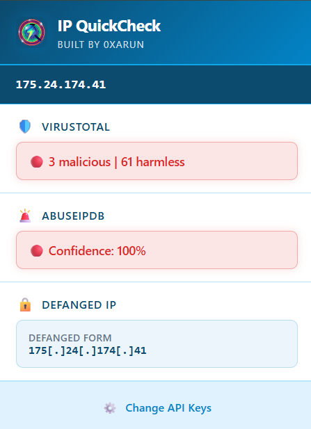
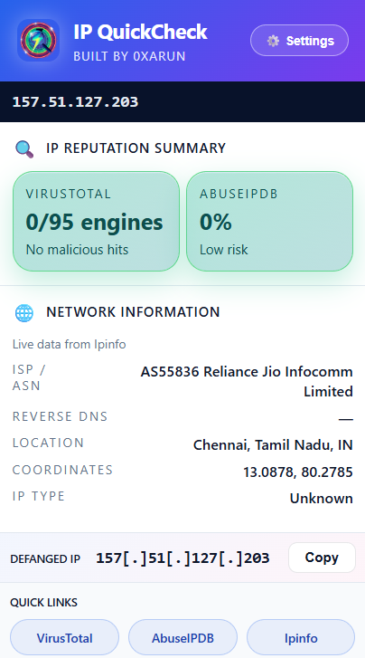
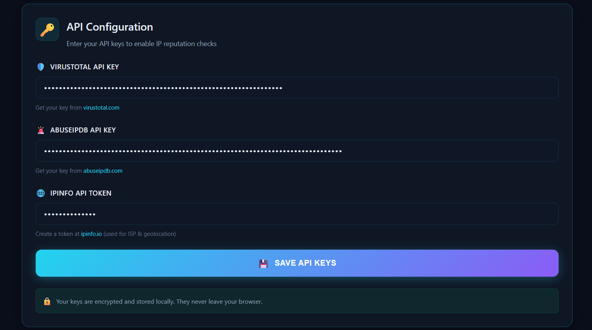
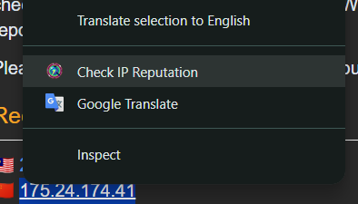

<div align="center">
  
</div>

# IP QuickCheck - One-Click IP Reputation Lookup

**Built by 0xarun**

IP QuickCheck is a lightweight browser extension designed for SOC Analysts, Threat Hunters, and Cybersecurity Engineers who frequently investigate IP addresses. Right-click any IP address to get instant reputation results from your preferred sources.

## Features

- **One-click IP reputation lookup** - Right-click context menu integration
- **Live data from VirusTotal, AbuseIPDB & Ipinfo** - Fetches real-time reputation and network context
- **Secure API key storage** - All keys stored locally in browser storage
- **Fast and minimal interface** - Clean, color-coded UI for quick analysis
- **Cross-browser support** - Works on Chrome, Edge, Brave, Opera
- **Defanged IP display** - Automatically shows defanged IP format for safe sharing
- **Ipinfo network insight** - ISP, ASN, geo coordinates, and privacy flags
- **Color-coded results** - Malicious IPs shown in red, safe IPs in green

## How It Works

1. **Install the extension** - Load it into your browser
2. **Enter your API keys** - Configure VirusTotal & AbuseIPDB API keys in the options page
3. **Right-click any IP** - Select "Check IP Reputation" from the context menu
4. **View results** - Popup shows categorized results instantly with color-coded indicators

## Installation

### From Source

1. Clone or download this repository
2. Open your browser's extension management page:
   - Chrome/Edge: `chrome://extensions/`
   - Brave: `brave://extensions/`
   - Opera: `opera://extensions/`
3. Enable "Developer mode"
4. Click "Load unpacked" and select the extension directory
5. The extension will open the options page automatically for API key setup

## API Keys Setup

You'll need API keys from:

- **VirusTotal**: Get your API key from [VirusTotal API](https://www.virustotal.com/gui/join-us)
- **AbuseIPDB**: Get your API key from [AbuseIPDB API](https://www.abuseipdb.com/pricing)
- **Ipinfo**: Generate a token from [ipinfo.io](https://ipinfo.io/signup) (free tier works)

1. Right-click the extension icon and select "Options"
2. Enter your VirusTotal API key
3. Enter your AbuseIPDB API key
4. (Optional but recommended) Enter your Ipinfo token for ISP/geolocation context
5. Click "Save"

## Privacy

- **Your API keys never leave your browser** - All keys stored locally
- **No tracking** - No external storage or analytics
- **All processing happens locally** - IP lookups go directly to VirusTotal and AbuseIPDB APIs

## Usage

### Context Menu

1. Select any IP address on a webpage
2. Right-click and choose "Check IP Reputation"
3. The popup will display:
   - **VirusTotal Results**: Malicious and harmless detection counts
   - **AbuseIPDB Results**: Abuse confidence score (0-100)
   - **Ipinfo Network Insights**: ISP/ASN, geo coordinates, privacy flags
   - **Defanged IP**: Safe-to-share format with brackets
   - **Quick Links**: Jump straight to details on VT, AbuseIPDB, or Ipinfo

### Extension Popup

Click the extension icon to open the popup and view the last checked IP's reputation plus the most recent network telemetry.

## Color Coding

- **Green**: Safe IP (no malicious detections, low abuse score)
- **Red**: Malicious IP (has detections or high abuse score)
- **Neutral**: Moderate risk (some detections or medium abuse score)

## Screenshots

### Extension Popup Views
<table>
  <tr>
    <td align="center">
      <strong>Reputation Summary</strong><br>
      
    </td>
    <td align="center">
      <strong>Network Insights</strong><br>
      
    </td>
  </tr>
</table>

### Setup Page


### Working Example


## Browser Compatibility

- Chrome (Manifest V3)
- Microsoft Edge
- Brave
- Opera

## Development

### Project Structure

```
ip-quickcheck/
├── assets/          # Extension icons (16, 32, 48, 128, 300) and screenshots
├── background.js    # Service worker for API calls
├── manifest.json    # Extension manifest
├── options/         # Options page (API key setup)
│   ├── options.html
│   ├── options.css
│   └── options.js
└── popup/           # Extension popup
    ├── popup.html
    ├── popup.css
    └── popup.js
```

### Permissions

- `contextMenus`: For right-click menu integration
- `storage`: For local API key storage
- `host_permissions`: For VirusTotal, AbuseIPDB, and Ipinfo API access

## License

This project is built by 0xarun. Use responsibly and in accordance with VirusTotal and AbuseIPDB terms of service.

## Support

For issues or questions, please check the extension's options page or contact the developer.

---

**Note**: This extension requires valid API keys from VirusTotal and AbuseIPDB to function. Free tier API keys are available from both services.

